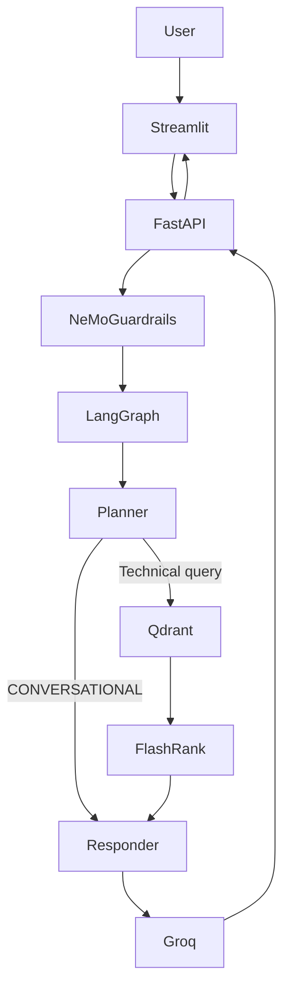
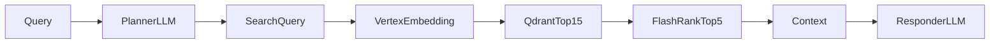
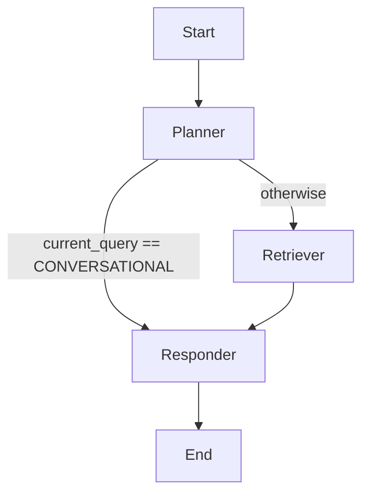
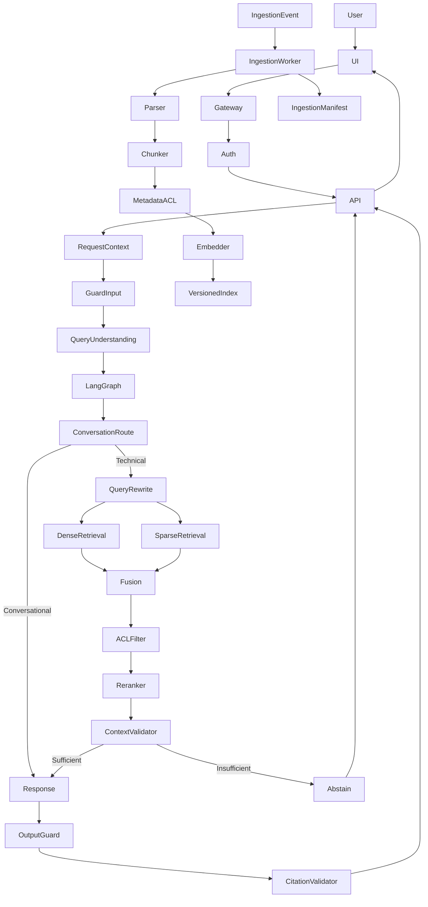

# Enterprise RAG Production Analysis

## Audit Scope

This is a read-only, repository-specific audit of the Enterprise RAG implementation as it existed during review. No application code was changed for the audit. The report is based on the application source, deployment configuration, Dockerfiles, dependency manifests, UI, ingestion code, and repository documentation.

Validation performed:

- All 25 application Python files parsed successfully with the standard AST parser.
- No automated test suite was found.
- Terraform validation could not be run because the `terraform` executable was unavailable in the environment.
- Credential values are intentionally omitted. Locations are reported so they can be remediated.

## Executive Summary

The project is a functional prototype consisting of a Streamlit frontend, FastAPI API, LangGraph workflow, Groq LLM calls, Vertex AI embeddings, Qdrant dense retrieval, FlashRank reranking, NeMo Guardrails, and a CLI-oriented document ingestion pipeline.

The active request path is:



The system is not enterprise production-ready. The highest-risk issues are:

1. Credentials are present in `.env` and `terraform/terraform.tfvars`.
2. Backend and UI Cloud Run services are public and `/query` has no authentication.
3. Cloud SQL is configured with `0.0.0.0/0`.
4. There is no tenant or document-level authorization.
5. The ingestion image points to `app.ingestion.processor:app`, but that module defines no FastAPI `app`.
6. Eventarc sends object-finalized events, but the processor only scans local directories through its CLI.
7. Re-ingestion generates random UUIDs and creates duplicate vectors.
8. Retrieval has no ACL filters, score threshold, citation preservation, or context validation.
9. Guardrails only gate the initial request and use brittle response-text matching.
10. No behavioral tests, RAG evaluation suite, citation validator, or grounding evaluator exists.

## 1. Repository Architecture Map

| Component | Location | Assessment |
|---|---|---|
| Streamlit frontend | [ui/app.py](ui/app.py) | Implemented |
| FastAPI API | [app/main.py](app/main.py) | Implemented |
| LangGraph workflow | [app/agents/graph.py](app/agents/graph.py) | Implemented |
| Agent state | [app/agents/state.py](app/agents/state.py) | Implemented, weakly typed |
| Planner | [app/agents/nodes/planner.py](app/agents/nodes/planner.py) | Implemented |
| Retriever | [app/agents/nodes/retriever.py](app/agents/nodes/retriever.py) | Implemented |
| Responder | [app/agents/nodes/responder.py](app/agents/nodes/responder.py) | Implemented |
| Vertex embeddings | [app/services/retrieval/embedding.py](app/services/retrieval/embedding.py) | Implemented |
| Qdrant search | [app/services/retrieval/qdrant_service.py](app/services/retrieval/qdrant_service.py) | Implemented |
| FlashRank reranking | [app/services/retrieval/ranking_service.py](app/services/retrieval/ranking_service.py) | Implemented and reachable |
| Document ingestion | [app/ingestion/processor.py](app/ingestion/processor.py) | CLI implemented, service missing |
| PDF parsing | [app/ingestion/loaders/pdf.py](app/ingestion/loaders/pdf.py) | Implemented |
| HTML parsing | [app/ingestion/loaders/html.py](app/ingestion/loaders/html.py) | Implemented |
| Office parsing | [app/ingestion/loaders/office.py](app/ingestion/loaders/office.py) | Implemented |
| Text parsing | [app/ingestion/loaders/text.py](app/ingestion/loaders/text.py) | Implemented |
| NeMo request guard | [app/graudrails/rails.py](app/graudrails/rails.py) | Partial |
| Guardrail definitions | [app/graudrails/colang_rules.py](app/graudrails/colang_rules.py) | Narrow implementation |
| GCS storage | [app/ingestion/processor.py](app/ingestion/processor.py) | Implemented |
| Cloud Run | [terraform/cloud_run.tf](terraform/cloud_run.tf) | Partial and insecure |
| Eventarc | [terraform/ingestion.tf](terraform/ingestion.tf) | Incorrectly wired |
| Cloud SQL | [terraform/database.tf](terraform/database.tf) | Unused and insecure |
| Redis | [terraform/main.tf](terraform/main.tf) | Provisioned but unused |
| Automated evaluation | Repository-wide | Missing |
| Automated tests | Repository-wide | Missing |
| Authentication | Repository-wide | Missing |
| Authorization/RBAC | Repository-wide | Missing |
| Multi-tenancy | Repository-wide | Missing |
| Conversation persistence | Runtime | Missing; only in-memory checkpointing |
| Semantic cache | Runtime | Missing |
| Citation validation | Repository-wide | Missing |

## 2. Actual RAG Architecture

### Classification

The implementation is best classified as **basic agent-routed, single-query dense RAG with cross-encoder reranking**.

It is not full advanced RAG, Corrective RAG, Self-RAG, Hybrid RAG, Graph RAG, or multi-agent RAG.

The planner makes one LLM call and chooses either `CONVERSATIONAL` or one free-text search query. The technical path then performs one embedding, one Qdrant search, FlashRank reranking, and one answer-generation call.

| Capability | Status |
|---|---|
| Dense RAG | Implemented |
| Agent-routed RAG | Implemented, basic |
| Advanced RAG | Partial |
| Agentic RAG | Partial |
| Corrective RAG | Missing |
| Self-RAG | Missing |
| Hybrid retrieval | Missing |
| Graph RAG | Missing |
| Multi-agent RAG | Missing |
| Multi-hop retrieval | Missing |
| Query rewriting | Partial |
| Query expansion | Missing |
| Reranking | Implemented |
| Context compression | Missing |
| Grounded answer validation | Missing |

## 3. Ingestion Analysis

### Supported formats

The processor supports PDF, HTML/HTM, TXT, DOCX, and PPTX in [app/ingestion/processor.py](app/ingestion/processor.py).

PDFs are processed with Google Document AI and split into 15-page requests in [app/ingestion/loaders/pdf.py](app/ingestion/loaders/pdf.py). HTML uses BeautifulSoup, text uses UTF-8 file reads, and Office documents use `unstructured`.

### Strengths

- Multiple common enterprise formats are supported.
- Large PDFs are split to work around synchronous Document AI page limits.
- Raw and processed files are uploaded to GCS.
- Embeddings are generated in batches.
- Qdrant collection creation is automated.

### Gaps

- Page numbers, headings, tables, bounding boxes, and source offsets are discarded.
- No language detection or encoding fallback exists.
- No file size, MIME, archive, or malware validation exists.
- No document content hashing exists.
- No duplicate detection exists.
- No incremental manifest exists.
- No document versioning exists.
- No deletion or revocation workflow exists.
- No failed-document queue or retry record exists.
- No ingestion job status exists.
- No tenant or ACL metadata is attached.

### Chunking

The chunker in [app/ingestion/chunking/splitter.py](app/ingestion/chunking/splitter.py) is paragraph-based with a default character limit of 1,000.

It has no overlap, token-based sizing, semantic boundary detection, parent-child relationship, page metadata, heading metadata, chunk IDs, or structure-aware handling for tables and Office sections. A paragraph larger than the limit can itself exceed the configured limit.

This is basic character/paragraph chunking, not semantic chunking.

### Metadata

Each vector receives only:

```text
text
source
source_type
raw_gcs_path
```

Missing fields include document ID, chunk ID, tenant ID, owner, ACL, version, content hash, MIME type, page number, heading, timestamps, ingestion job ID, and embedding model version.

### Re-ingestion and failure handling

Every vector receives `str(uuid.uuid4())` in [app/ingestion/processor.py](app/ingestion/processor.py). Reprocessing the same document therefore creates additional vectors instead of replacing the old version. The `wipe` flag deletes the entire collection and is a destructive workaround rather than lifecycle management.

`process_file()` catches exceptions and logs them without recording a failure or re-raising. A batch can appear successful while individual documents silently fail.

## 4. Embedding Architecture

The embedding service is [app/services/retrieval/embedding.py](app/services/retrieval/embedding.py).

| Property | Current implementation |
|---|---|
| Provider | Google Vertex AI |
| Model | `text-embedding-005` |
| Dimension | Collection hardcoded to 768 |
| Distance | Qdrant cosine |
| Batch size | 250 |
| Query/document consistency | Same embedding implementation |
| Normalization | Not explicit |
| Cache | Missing |
| Versioning | Missing |
| Multilingual configuration | Missing |
| Domain adaptation | Missing |
| Retry/timeout | Missing or implicit |

Using the same model for ingestion and retrieval is correct. Changing the model would require re-embedding all documents. If the dimension changes, a new collection is required. The current system has no model-version metadata or blue/green index migration strategy.

## 5. Vector Database Analysis

Qdrant integration is in [app/services/retrieval/qdrant_service.py](app/services/retrieval/qdrant_service.py), with collection creation in [app/ingestion/processor.py](app/ingestion/processor.py).

Implemented: Qdrant Cloud client, cosine search, payload retrieval, configurable limits, and collection creation.

Missing: metadata filtering, tenant filtering, ACL filtering, score thresholds, sparse vectors, hybrid search, parent-document lookup, deletion, version filtering, aliases, payload schema validation, and lifecycle operations.

The retrieval function accepts only a query and limit. It receives no user, tenant, role, or authorization context. Every caller searches the same collection. This creates a critical cross-user and cross-tenant data leakage risk.

## 6. Retrieval Pipeline



Current behavior:

- One planner-generated query.
- One dense embedding.
- Qdrant top 15.
- FlashRank top 5.
- Character-based context cap of 25,000.
- No score threshold.
- No deduplication.
- No metadata filtering.
- No query decomposition.
- No context compression.
- No retrieval-quality decision.

The planner provides a partial query rewrite, but it has no structured output, validation, confidence, multiple search variants, or multi-hop decomposition.

Ambiguous and multi-hop questions are likely to retrieve only one semantic slice. Follow-up questions receive history, but retrieval query construction remains fragile. Questions absent from the knowledge base are especially risky because Qdrant still returns nearest neighbors and there is no abstention policy.

## 7. Reranking Analysis

Reranking is implemented and reachable in [app/services/retrieval/ranking_service.py](app/services/retrieval/ranking_service.py).

| Property | Current implementation |
|---|---|
| Model | FlashRank `ms-marco-MiniLM-L-6-v2` |
| Input | Up to 15 plain document strings |
| Output | Top 5 plain strings |
| Reranker scores returned | No |
| Source metadata preserved | No |
| Failure fallback | Original first `top_k` documents |
| Initialization | Lazy |
| Timeout | Missing |

The reranker discards Qdrant result objects and keeps only text. This loses Qdrant scores, source names, IDs, and future ACL metadata. The API therefore returns raw chunk text as sources rather than trustworthy citation records.

No evaluation demonstrates that reranking improves retrieval quality.

## 8. LangGraph and Agent Architecture

The graph in [app/agents/graph.py](app/agents/graph.py) is:



### Planner

Location: [app/agents/nodes/planner.py](app/agents/nodes/planner.py)

Purpose: classify conversational requests or generate a search query.

Inputs: conversation messages and history.

Outputs: `current_query`, `plan`, and `status`.

Failure modes: provider errors, timeouts, arbitrary output, prompt injection through history, and nonsensical search queries.

Reachability: every request that passes the guard.

Assessment: useful in concept, but it relies on unvalidated free-form LLM output.

### Retriever

Location: [app/agents/nodes/retriever.py](app/agents/nodes/retriever.py)

Purpose: Qdrant retrieval followed by FlashRank reranking.

Inputs: `current_query` and `plan`.

Outputs: formatted document strings, status, and updated plan.

Failure modes: embedding failure, Qdrant failure, empty results, reranker failure, and missing authorization filtering.

Reachability: every non-conversational planner result.

Assessment: functional, but metadata is discarded and empty retrieval is not treated as an error or abstention condition.

### Responder

Location: [app/agents/nodes/responder.py](app/agents/nodes/responder.py)

Purpose: generate conversational or technical answers.

Inputs: query, conversation history, and documents.

Outputs: `messages`, `final_answer`, and `status` on success.

Failure modes: Groq failure, empty context, prompt injection through context, unsupported claims, and state key inconsistency.

Assessment: functional but not grounded or citation-aware.

### State problems

Location: [app/agents/state.py](app/agents/state.py)

- `documents` is typed as `List[dict]`, but the retriever returns `List[str]`.
- State uses `message`, while the responder error path returns `messages`.
- No typed message model exists.
- No user ID, tenant ID, role, request ID, retrieval scores, citation objects, error field, or confidence field exists.

### Checkpointing

The graph uses `MemorySaver()`. This is process-local and unsuitable for Cloud Run production. State disappears on restart, is not shared across instances, and has no retention policy. Although Postgres checkpointing dependencies are declared, no `PostgresSaver` is used.

## 9. LLM Architecture

All active LLM calls use `ChatGroq` in the planner, responder, and guardrail modules.

Current configuration:

- Main model: `llama-3.3-70b-versatile`.
- Planner temperature: `0`.
- Responder temperature: `0.1`.
- Responder retries: `2`.
- Planner retries: not configured.
- Explicit timeout: not configured.
- Streaming: not implemented.
- Structured output: not implemented.
- Tool calling: not implemented.
- Provider fallback: not implemented.
- Cost controls: not implemented.

The implementation is tightly coupled to Groq. Dependencies advertise Vertex, OpenAI, Portkey, and NVIDIA integrations, but no provider abstraction or runtime fallback exists.

The NeMo YAML declares an OpenAI `gpt-3.5-turbo` model while [app/graudrails/rails.py](app/graudrails/rails.py) injects a Groq model. This configuration should be verified and simplified.

## 10. Prompt Engineering

Prompts are embedded directly in Python functions rather than versioned templates.

Strengths:

- Planner has a defined classification task.
- Responder defines the intended domain.
- Conversational mode attempts to limit off-topic responses.

Weaknesses:

- No prompt versioning or prompt tests.
- No robust context delimiters.
- No citation requirements.
- No explicit answer-only-from-context requirement.
- No insufficient-evidence response policy.
- No contradiction handling.
- No output schema.
- Full history and raw document text are interpolated into prompts.
- Planner output is trusted as a search query.

The technical responder prompt is particularly weak because it asks the model to use context without requiring the response to be supported exclusively by that context.

## 11. Hallucination Prevention

There is no reliable hallucination prevention layer.

| Control | Status |
|---|---|
| Context-only answer requirement | Prompt-level partial implementation |
| Retrieval score threshold | Missing |
| Empty-context refusal | Missing |
| Confidence estimation | Missing |
| Citation generation | Missing |
| Citation validation | Missing |
| Grounding evaluator | Missing |
| Contradiction detection | Missing |
| Answer support verification | Missing |
| Unsupported-question refusal | Partial, limited guardrail coverage |

For fully supported questions, answers may be useful but are not validated. For partially supported or unsupported questions, the model may fill gaps from prior knowledge. Contradictory documents are passed together without source authority or conflict policy. Requests to ignore context are only partially addressed by brittle guardrails.

## 12. Guardrails and Security

The request guard is implemented in [app/graudrails/rails.py](app/graudrails/rails.py), with rules in [app/graudrails/colang_rules.py](app/graudrails/colang_rules.py).

Protected partially:

- Initial user query.
- Some exact off-topic examples.
- Some exact jailbreak phrases.
- Greeting, farewell, and capability phrases.

Bypassed:

- Retrieved documents.
- Planner output.
- Generated response.
- Conversation history after the initial gate.
- PII and secret detection.
- Document authorization.
- Tool-call protection.

The firing decision depends on whether the raw guardrail response contains one of the strings in `RAIL_INDICATORS`. This can miss paraphrases, produce false positives, or fail if the guardrail response uses a different valid refusal.

### Threat model

User-side threats include prompt injection, jailbreaks, system prompt extraction, long-query denial of service, public endpoint abuse, and semantic data enumeration.

Document-side threats include instructions embedded in malicious documents, poisoned content, unsafe URLs, false authority claims, and attempts to make the model disclose other retrieved content. Raw retrieved text is inserted into the responder prompt without a strong untrusted-content boundary.

## 13. CRAG Analysis

Corrective RAG is not implemented. There is no retrieval-quality evaluator, web-search fallback, external-source trust policy, provenance distinction, or safe external-content ingestion path.

## 14. Evaluation and DeepEval

No evaluation implementation was found. `ragas`, `deepeval`, and `sentence-transformers` are declared in [requirements.txt](requirements.txt), but no test cases, golden answers, expected contexts, thresholds, CI jobs, or regression suite exists.

Missing retrieval metrics include Recall@K, Precision@K, MRR, NDCG, hit rate, source coverage, and ACL-filtered retrieval correctness.

Missing generation metrics include faithfulness, answer relevance, context relevance, context precision, context recall, groundedness, citation correctness, and abstention quality.

Recommended evaluation records should include:

```text
case_id
tenant_id
user_role
question
conversation_history
expected_intent
gold_answer
gold_document_ids
gold_chunk_ids
required_facts
unsupported_facts
expected_citations
should_abstain
sensitivity_classification
attack_category
```

## 15. Observability

Manual Logfire spans and logs exist in the API, guardrail, planner, embedding, retrieval, reranking, response, ingestion, and UI paths.

Partially captured: planner span, embedding span, Qdrant search messages, reranking duration, guardrail span, response span, and UI session ID.

Missing: standardized request ID, trace propagation, authenticated principal, tenant ID, retrieval result IDs, structured retrieval scores, reranking scores, token counts, cost, model latency breakdown, guardrail reason, grounding result, ingestion job ID, document version, cache status, rate-limit events, and PII redaction.

The current telemetry does not provide a dependable end-to-end audit record for a request.

## 16. Performance

The technical request generally performs a guardrail LLM call, planner LLM call, embedding request, Qdrant request, local reranking, and responder LLM call.

Likely bottlenecks:

- Synchronous FastAPI handlers around blocking provider calls.
- FlashRank cold initialization.
- No cache.
- No parallel retrieval.
- No streaming from the LLM.
- No Cloud Run concurrency or minimum-instance tuning.
- Large prompt construction in memory.
- UI simulates streaming with `time.sleep(0.02)` after the response is already complete.

## 17. Caching

No runtime cache is implemented. Redis is provisioned in [terraform/main.tf](terraform/main.tf), and `USE_SEMANTIC_CACHE=true` is configured in Terraform, but no Redis client calls exist.

Missing cache types include exact query, semantic query, embedding, retrieval, and LLM response caches. Any future cache key must include tenant, authorization scope, model version, prompt version, and index version.

## 18. Database and Persistence

Cloud SQL is provisioned in [terraform/database.tf](terraform/database.tf), but runtime code does not use SQLAlchemy, the Cloud SQL connector, Postgres checkpointing, or a conversation database.

There is no active persistence for conversations, documents, ingestion jobs, audit events, or metadata. No migrations, transactions, retention policies, or lifecycle management exist.

## 19. Multi-Tenancy

Multi-tenancy is missing at authentication, API identity, Qdrant filtering, payload metadata, cache, conversation history, logging, GCS object organization, evaluation, and administration layers.

The client-supplied `thread_id` is not a security boundary and is not tied to an authenticated principal.

## 20. Authentication and Authorization

There is no authentication or authorization middleware in [app/main.py](app/main.py). The API accepts only a query and optional thread ID.

The backend and UI are granted public Cloud Run invocation in [terraform/cloud_run.tf](terraform/cloud_run.tf). A caller can directly invoke `/query`, use arbitrary thread IDs, and search the shared Qdrant collection.

## 21. Error Handling

Positive aspects:

- Embedding exceptions are logged and raised.
- Qdrant failures return an empty list.
- Reranker failures fall back to original documents.
- The API returns a generic response on top-level failure.
- PDF parsing errors are logged.

Problems:

- Qdrant failure is indistinguishable from empty retrieval.
- File failures are swallowed.
- No provider-specific retries or backoff exist.
- No explicit timeout policy exists.
- No rate-limit handling exists.
- No structured error codes exist.
- No health/readiness endpoints exist.
- No circuit breakers exist.
- No LLM output schema validation exists.

The responder error path returns `message` instead of the state/API convention `messages` and does not set `final_answer`, so the API can return a missing answer after an LLM failure.

## 22. Testing

No test files were found. Missing categories include unit, chunking, loader, embedding, retrieval, reranking, planner, responder, graph, API, guardrail, security, tenant-isolation, ingestion integration, evaluation, end-to-end, regression, and deployment smoke tests.

The application has syntax validation but no behavioral validation.

## 23. Configuration and Secrets

Configuration is partially centralized in [app/config.py](app/config.py), but values are not validated consistently, critical settings have defaults, model and collection names are hardcoded, and environment variables are mutated as import side effects.

Sensitive material was found in `.env`, [terraform/terraform.tfvars](terraform/terraform.tfvars), and `.logfire/logfire_credentials.json`. Values are intentionally not reproduced here. Treat all affected credentials as compromised, rotate them, remove them from deployment inputs and history, and use Secret Manager or Cloud Run secret references.

## 24. Code Quality

Strengths:

- Basic separation between agents, services, ingestion, and loaders.
- Lazy initialization for several external clients.
- Small and understandable graph.
- PDF processing isolated from other loaders.
- Reranker fallback exists.

Weaknesses:

- Package name `graudrails` is misspelled.
- Runtime data types do not match `AgentState`.
- Unused imports and advertised but unused infrastructure exist.
- Error handling and logging styles are inconsistent.
- External Qdrant client is created at module import time.
- Prompts are duplicated and embedded in nodes.
- No provider interfaces exist.
- CLI ingestion and intended Eventarc service are conflated.
- Root [main.py](main.py) is placeholder code.
- [README.md](README.md) is empty.
- No operational runbooks or API usage guide exist.

## 25. Architecture Ratings

| Target | Rating | Assessment |
|---|---:|---|
| Prototype | 7/10 | Real providers and a working RAG demonstration |
| MVP | 4/10 | Basic flow exists, but no tests, auth, or reliable persistence |
| Production | 2/10 | Public access, secret exposure, broken ingestion, weak resilience |
| Enterprise production | 1/10 | No tenant isolation, RBAC, auditability, evaluation, or governance |

## 26. Enterprise RAG Maturity Score

| Category | Score / 10 |
|---|---:|
| Architecture | 4 |
| Ingestion | 4 |
| Chunking | 3 |
| Embeddings | 5 |
| Retrieval | 4 |
| Reranking | 5 |
| Agent orchestration | 4 |
| LLM architecture | 3 |
| Prompt engineering | 3 |
| Hallucination prevention | 2 |
| Guardrails | 3 |
| Security | 1 |
| Multi-tenancy | 0 |
| Evaluation | 0 |
| DeepEval | 0 |
| Observability | 3 |
| Performance | 3 |
| Caching | 0 |
| Testing | 0 |
| Error handling | 2 |
| Code quality | 4 |
| Scalability | 2 |
| Documentation | 1 |

**Overall maturity: approximately 2.6 / 10.**

## 27. Modern Enterprise RAG Comparison

| Capability | Status |
|---|---|
| Dense retrieval | Implemented |
| Metadata filtering | Missing |
| Hybrid retrieval | Missing |
| Reranking | Implemented |
| Query rewriting | Partial |
| Query expansion | Missing |
| Agentic retrieval | Partial |
| Access-controlled retrieval | Missing |
| Multi-tenancy | Missing |
| Citations | Partial; raw chunks only |
| Citation validation | Missing |
| Prompt-injection protection | Partial |
| Document-side injection protection | Missing |
| Grounding validation | Missing |
| Semantic cache | Missing |
| Streaming | Missing; UI simulation only |
| Model fallback | Missing |
| Provider abstraction | Missing |
| Document versioning | Missing |
| Incremental indexing | Missing |
| Idempotent ingestion | Missing |
| Auditability | Missing |
| Human-in-the-loop | Missing |
| Offline evaluation | Missing |
| Online evaluation | Missing |
| CI/CD | Partial; image build only |
| Production monitoring | Partial |
| Backup/recovery | Partial infrastructure only |
| RBAC | Missing |
| Rate limiting | Missing |
| PII controls | Missing |
| Secrets management | Incorrect |
| Health checks | Missing |

## 28. Top 20 Problems

### 1. Critical: exposed credentials

**Location:** `.env`, [terraform/terraform.tfvars](terraform/terraform.tfvars), `.logfire/logfire_credentials.json`  
**Component:** Secret management  
**Problem:** Provider keys, database credentials, and observability credentials are present in local configuration.  
**Impact:** Credential compromise, unauthorized provider access, quota exhaustion, and possible data access.  
**Recommendation:** Rotate all affected credentials immediately, remove them from files and history, and use Secret Manager.  
**Estimated effort:** 2–4 hours plus provider remediation.

### 2. Critical: public unauthenticated backend

**Location:** [terraform/cloud_run.tf](terraform/cloud_run.tf), [app/main.py](app/main.py)  
**Component:** API security  
**Problem:** Cloud Run grants `allUsers` invocation and `/query` has no authentication.  
**Impact:** Unbounded abuse, data exposure, prompt injection, and provider cost abuse.  
**Recommendation:** Add OIDC/JWT authentication, authorization, rate limiting, and quotas.  
**Estimated effort:** 2–5 days.

### 3. Critical: no tenant or document authorization

**Location:** [app/services/retrieval/qdrant_service.py](app/services/retrieval/qdrant_service.py), [app/main.py](app/main.py)  
**Component:** Retrieval security  
**Problem:** All callers search one shared collection without user or tenant context.  
**Impact:** Critical cross-tenant data leakage.  
**Recommendation:** Propagate authenticated claims and filter Qdrant payloads by tenant and ACL.  
**Estimated effort:** 1–2 weeks.

### 4. Critical: ingestion container cannot start as configured

**Location:** [docker/ingestion.Dockerfile](docker/ingestion.Dockerfile), [app/ingestion/processor.py](app/ingestion/processor.py)  
**Component:** Deployment  
**Problem:** Docker runs `app.ingestion.processor:app`, but no `app` object exists.  
**Impact:** Cloud Run startup/import failure and failed ingestion.  
**Recommendation:** Add an Eventarc HTTP receiver or deploy the processor as a job.  
**Estimated effort:** 1–2 days.

### 5. Critical: publicly reachable Cloud SQL

**Location:** [terraform/database.tf](terraform/database.tf)  
**Component:** Infrastructure security  
**Problem:** `authorized_networks` allows `0.0.0.0/0`.  
**Impact:** Public database attack surface and possible data compromise.  
**Recommendation:** Use private IP, VPC-only access, Cloud SQL connector, backups, and deletion protection.  
**Estimated effort:** 1–2 days.

### 6. Critical: no grounding or abstention

**Location:** [app/agents/nodes/responder.py](app/agents/nodes/responder.py), [app/services/retrieval/qdrant_service.py](app/services/retrieval/qdrant_service.py)  
**Component:** Answer correctness  
**Problem:** No score threshold, no-context refusal, citation check, or answer validator exists.  
**Impact:** Confident unsupported answers from nearest-neighbor noise.  
**Recommendation:** Add thresholds, abstention, citations, and grounding evaluation.  
**Estimated effort:** 3–5 days.

### 7. High: non-idempotent ingestion

**Location:** [app/ingestion/processor.py](app/ingestion/processor.py)  
**Component:** Index lifecycle  
**Problem:** Random UUIDs are generated for every chunk.  
**Impact:** Duplicate vectors, stale content, increased index size, and possible stale-content exposure.  
**Recommendation:** Use deterministic IDs based on document and content hashes plus version records.  
**Estimated effort:** 2–4 days.

### 8. High: Eventarc events are not processed

**Location:** [terraform/ingestion.tf](terraform/ingestion.tf), [app/ingestion/processor.py](app/ingestion/processor.py)  
**Component:** Incremental ingestion  
**Problem:** Eventarc is configured for finalized GCS objects, but the processor only scans local directories.  
**Impact:** Automatic uploads do not produce indexed documents.  
**Recommendation:** Parse CloudEvent object metadata and download/process the object.  
**Estimated effort:** 1–3 days.

### 9. High: brittle guardrails

**Location:** [app/graudrails/rails.py](app/graudrails/rails.py), [app/graudrails/colang_rules.py](app/graudrails/colang_rules.py)  
**Component:** Safety  
**Problem:** Rail decisions depend on a limited phrase list and response substring matching.  
**Impact:** Paraphrased jailbreaks and inconsistent refusals.  
**Recommendation:** Use structured rail events, input/output rails, classifiers, and adversarial tests.  
**Estimated effort:** 4–7 days.

### 10. High: reranking discards provenance

**Location:** [app/agents/nodes/retriever.py](app/agents/nodes/retriever.py), [app/services/retrieval/ranking_service.py](app/services/retrieval/ranking_service.py)  
**Component:** Retrieval provenance  
**Problem:** Only strings are passed through FlashRank.  
**Impact:** Scores, source names, IDs, and ACL metadata are lost.  
**Recommendation:** Rerank structured records and preserve all metadata.  
**Estimated effort:** 1–2 days.

### 11. High: no document prompt-injection boundary

**Location:** [app/agents/nodes/responder.py](app/agents/nodes/responder.py)  
**Component:** LLM security  
**Problem:** Retrieved text is interpolated directly into the prompt.  
**Impact:** Malicious documents can influence model behavior or attempt data disclosure.  
**Recommendation:** Delimit untrusted content, scan for injection, and prohibit following document instructions.  
**Estimated effort:** 2–4 days.

### 12. High: in-memory checkpointing

**Location:** [app/agents/graph.py](app/agents/graph.py)  
**Component:** Conversation persistence  
**Problem:** `MemorySaver` is process-local.  
**Impact:** State disappears on restart and fragments across Cloud Run instances.  
**Recommendation:** Configure durable Postgres checkpointing or an explicit conversation store.  
**Estimated effort:** 2–4 days.

### 13. High: inconsistent responder error contract

**Location:** [app/agents/nodes/responder.py](app/agents/nodes/responder.py), [app/agents/state.py](app/agents/state.py)  
**Component:** Error handling  
**Problem:** Error path returns `message` instead of `messages` and omits `final_answer`.  
**Impact:** Failed requests can return an incomplete API object.  
**Recommendation:** Use one validated state schema and typed error result.  
**Estimated effort:** 2–4 hours.

### 14. High: absent retry and timeout policy

**Location:** [app/services/retrieval/embedding.py](app/services/retrieval/embedding.py), [app/services/retrieval/qdrant_service.py](app/services/retrieval/qdrant_service.py), [app/agents/nodes/planner.py](app/agents/nodes/planner.py)  
**Component:** Reliability  
**Problem:** Provider calls have inconsistent or absent timeouts and retries.  
**Impact:** Transient failures become empty retrievals or user-visible failures.  
**Recommendation:** Add bounded timeouts, exponential backoff, and circuit breakers.  
**Estimated effort:** 2–4 days.

### 15. Medium: unused Redis cache

**Location:** [terraform/main.tf](terraform/main.tf), [terraform/cloud_run.tf](terraform/cloud_run.tf)  
**Component:** Performance/infrastructure  
**Problem:** Redis is provisioned and enabled by configuration but no runtime cache calls exist.  
**Impact:** Infrastructure cost and complexity without behavior benefit.  
**Recommendation:** Remove it or implement tenant-safe caching.  
**Estimated effort:** 1–5 days.

### 16. Medium: incomplete CI/CD

**Location:** [cloudbuild.yaml](cloudbuild.yaml)  
**Component:** Delivery  
**Problem:** Pipeline builds and pushes images but does not run tests, scans, Terraform validation, or deployment gates.  
**Impact:** Broken or insecure changes can be published.  
**Recommendation:** Add tests, security scans, Terraform validation, immutable image tags, and staged deployment.  
**Estimated effort:** 2–5 days.

### 17. Medium: no evaluation framework

**Location:** [requirements.txt](requirements.txt), repository-wide  
**Component:** Quality assurance  
**Problem:** Ragas and DeepEval are declared but unused.  
**Impact:** Retrieval and answer quality cannot be measured or regressed.  
**Recommendation:** Build a golden dataset and CI evaluation suite.  
**Estimated effort:** 1–2 weeks.

### 18. Medium: synchronous blocking request path

**Location:** [app/main.py](app/main.py) and provider services  
**Component:** Performance  
**Problem:** Synchronous handlers call network LLM, embedding, and vector services.  
**Impact:** Worker saturation under concurrent traffic.  
**Recommendation:** Use async-compatible clients or bounded worker execution and tune Cloud Run concurrency.  
**Estimated effort:** 2–5 days.

### 19. Medium: no document lifecycle model

**Location:** [app/ingestion/processor.py](app/ingestion/processor.py)  
**Component:** Data governance  
**Problem:** No update, delete, retention, version, or revocation behavior exists.  
**Impact:** Removed or unauthorized content can remain searchable.  
**Recommendation:** Add a manifest, versions, deterministic IDs, deletion jobs, and index aliases.  
**Estimated effort:** 1–2 weeks.

### 20. Medium: no tests or operational documentation

**Location:** [README.md](README.md), repository-wide  
**Component:** Maintainability  
**Problem:** README is empty and no automated tests exist.  
**Impact:** Deployment and behavior are undocumented and regressions are undetected.  
**Recommendation:** Add setup, architecture, API, ingestion, security, runbook, and test documentation.  
**Estimated effort:** 3–5 days.

## 29. Quick Wins

### Less than 1 hour

- Rotate exposed credentials.
- Fix the responder error key contract.
- Add required-setting validation at startup.
- Add query length limits.
- Stop logging raw query text by default.

### 1–4 hours

- Add `/healthz` and `/readyz`.
- Add a Qdrant score threshold and explicit no-context response.
- Preserve source metadata through reranking.
- Add request IDs.
- Add a basic `/query` API test.
- Add Terraform validation to CI.

### 1 day

- Implement Eventarc CloudEvent handling.
- Add deterministic document/chunk IDs.
- Add provider retry/backoff.
- Add unit tests for chunking, routing, and errors.
- Add prompt delimiters and document-instruction restrictions.
- Remove or disable unused Redis/Postgres settings.

### 2–3 days

- Implement API authentication.
- Add tenant and ACL metadata to Qdrant filters.
- Configure durable checkpointing.
- Return structured citations.
- Add golden retrieval tests.
- Add deployment smoke tests.

### 1 week or more

- Build document lifecycle management.
- Add DeepEval/Ragas regression evaluation.
- Implement hybrid retrieval and query transformation.
- Add grounding and citation validation.
- Add provider fallback, cost controls, RBAC, auditing, PII controls, and security tests.

## 30. Production Risk Assessment

### Reliability

The ingestion service is misconfigured, Eventarc payloads are not consumed, provider failures have inconsistent handling, and in-memory state disappears on restart.

### Security

The backend and UI are public, credentials are exposed, Cloud SQL is publicly authorized, and there is no authentication, authorization, RBAC, rate limiting, or complete prompt-injection defense.

### Data leakage

The Qdrant collection is global, there is no tenant or ACL metadata, thread IDs are client-controlled, and document deletion is absent.

### Hallucination

There is no score threshold, abstention policy, citation validation, grounding evaluator, or contradiction handling.

### Retrieval quality

Retrieval is single-query dense search with weak chunking, no hybrid search, no filters, no decomposition, and duplicate accumulation.

### Performance and cost

The request path uses multiple sequential LLM/service calls, blocking handlers, no cache, cold reranking initialization, and no abuse controls.

### Scalability

Checkpointing is local, ingestion has no job queue or status model, and there is no index migration/lifecycle strategy.

### Observability

Manual spans exist, but request correlation, retrieval structure, token/cost metrics, quality signals, and redaction are incomplete.

### Maintainability

The README is empty, tests are absent, advertised infrastructure is unused, and provider coupling is high.

## 31. Recommended Target Architecture



The first additions should be authentication, tenant context, ACL-aware retrieval, deterministic indexing, Eventarc handling, durable checkpointing, grounding/citation validation, evaluation, and structured observability. Hybrid retrieval and advanced query decomposition should follow evidence from evaluation rather than being added blindly.

## 32. Implementation Roadmap

### Phase 1: Critical fixes

Objectives: rotate secrets, remove public database access, add API authentication, fix the ingestion service contract, add tenant/ACL context, and correct state/error schemas.

Affected components: [app/main.py](app/main.py), [app/agents/state.py](app/agents/state.py), [app/agents/nodes/responder.py](app/agents/nodes/responder.py), [app/services/retrieval/qdrant_service.py](app/services/retrieval/qdrant_service.py), [app/ingestion/processor.py](app/ingestion/processor.py), Docker, and Terraform.

Expected benefit: prevents immediate data leakage, restores deployment correctness, and establishes reliable identity context.

Estimated time: 1–2 weeks. Priority: Critical.

### Phase 2: RAG quality

Objectives: deterministic IDs, source-preserving reranking, improved chunking, score thresholds, abstention, citations, query transformation, and eventually hybrid search.

Affected components: chunker, ingestion manifest, embedding/indexing, Qdrant service, reranker, retriever, responder, and API schema.

Expected benefit: better recall, fewer duplicates, fewer hallucinations, and verifiable answers.

Estimated time: 1–3 weeks. Priority: High.

### Phase 3: Agent intelligence

Objectives: structured planner output, retrieval-quality routing, durable checkpointing, and controlled tool permissions if tools are later introduced.

Affected components: graph, state, planner, retriever, persistence, and security context.

Expected benefit: predictable orchestration and reliable follow-up conversations.

Estimated time: 1–2 weeks. Priority: High.

### Phase 4: Evaluation

Objectives: golden dataset, retrieval metrics, DeepEval/Ragas generation metrics, adversarial security cases, and CI regression gates.

Affected components: new evaluation package, CI, datasets, retrieval, prompts, and guardrails.

Expected benefit: measurable quality and protection against regressions.

Estimated time: 1–2 weeks. Priority: High.

### Phase 5: Observability

Objectives: request/trace/tenant correlation, token and cost metrics, structured retrieval telemetry, guardrail reasons, redaction, dashboards, and alerts.

Affected components: UI, API, graph nodes, retrieval, LLM wrappers, ingestion, and Logfire/Cloud Monitoring.

Expected benefit: faster diagnosis, auditability, and operational control.

Estimated time: 1 week. Priority: High.

### Phase 6: Performance

Objectives: bounded asynchronous execution, tenant-safe caching, parallel retrieval, real streaming, and Cloud Run tuning.

Affected components: API, provider adapters, Redis, graph, UI, and Terraform.

Expected benefit: lower latency, better concurrency, and reduced provider cost.

Estimated time: 1–2 weeks. Priority: Medium.

### Phase 7: Enterprise hardening

Objectives: RBAC, document ACLs, audit logging, versioned deletion, backup/recovery, supply-chain scanning, PII controls, and human review for sensitive workflows.

Affected components: identity, API, ingestion, storage, Qdrant, Cloud SQL, CI/CD, observability, and UI.

Expected benefit: compliance, governance, recovery, and enterprise operational readiness.

Estimated time: 2–6 weeks. Priority: High.

## Final Executive Summary

### Current state

The project demonstrates a real prototype loop: documents can be parsed, chunked, embedded, indexed in Qdrant, retrieved, reranked with FlashRank, and answered by Groq through a LangGraph flow. PDF processing and basic module separation are the strongest implementation areas.

### Major weaknesses

There is no identity or authorization model, tenant isolation, reliable ingestion service, document lifecycle, grounding control, evaluation suite, behavioral test suite, or durable conversation persistence. Several infrastructure components advertised in dependencies and Terraform are unused.

### Biggest risks

The most serious risks are cross-tenant document disclosure, exposed provider credentials, public API abuse, stale or duplicate indexed content, unsupported confident answers, silent ingestion failure, and loss of conversation state after scaling or restart.

### Biggest opportunities

Credential rotation, authentication, tenant-aware retrieval, Eventarc ingestion repair, deterministic indexing, citation preservation, score-based abstention, evaluation, and durable checkpointing will produce the largest immediate improvement.

### Overall score

**27 / 100**

### Production readiness

**❌ Not production ready**

The repository is suitable for experimentation and prototype demonstrations. It should not be deployed for enterprise users until authentication, authorization, tenant isolation, secret remediation, ingestion correctness, document lifecycle management, grounding controls, evaluation, and operational resilience are addressed.