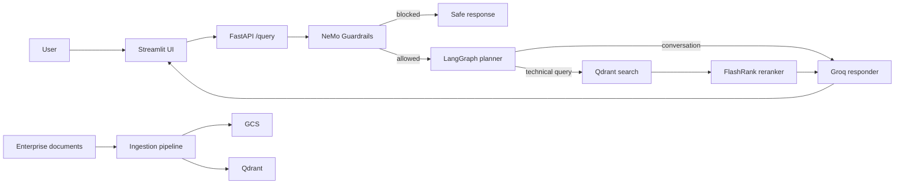

# Enterprise Agentic RAG

An enterprise-style Retrieval-Augmented Generation (RAG) assistant for technical documentation. The project combines a FastAPI service, a LangGraph agent workflow, Qdrant vector retrieval, semantic reranking, NeMo Guardrails, a Streamlit chat interface, and an evaluation suite built with RAGAS.

This is a portfolio project designed to demonstrate a practical RAG architecture rather than a single prompt-to-LLM demo.

## Highlights

- LangGraph agent that routes conversational questions directly to an answerer and technical questions through retrieval.
- Qdrant-backed semantic search followed by FlashRank cross-encoder reranking.
- Groq-hosted LLMs for planning and response generation.
- NeMo Guardrails gate before the RAG workflow.
- Streamlit chat interface with session-scoped conversation history and source display.
- Document ingestion for PDF, Office, HTML, and plain-text inputs.
- RAGAS evaluation UI and pipeline for faithfulness, relevancy, context quality, answer correctness, tool correctness, and guardrail behavior.
- Observability hooks for Logfire and LangSmith.
- Docker, Cloud Build, Cloud Run, Cloud SQL, Redis, GCS, and Terraform configuration.

## Architecture



## Repository Layout

```text
app/
	agents/                 LangGraph state, planner, retriever, responder
	graudrails/             NeMo Guardrails configuration and gate
	ingestion/              Document loaders, chunking, processing
	services/retrieval/     Embeddings, Qdrant search, FlashRank reranking
evals/                    Live pipeline, RAGAS metrics, guardrail evaluation
ui/                       Streamlit chat application
terraform/                GCP infrastructure configuration
docker/                   Container definitions
```

## Local Setup

Prerequisites:

- Python 3.10 or 3.11
- A Qdrant collection populated by the ingestion pipeline
- Groq API access
- Hugging Face access token for the hosted evaluator embeddings
- Google Cloud credentials when using Vertex AI embeddings and ingestion

Create and activate a virtual environment, then install the runtime dependencies:

```powershell
python -m venv enterprise_env
.\enterprise_env\Scripts\Activate.ps1
python -m pip install --upgrade pip
python -m pip install -r requirements-backend.txt
python -m pip install streamlit nest-asyncio pandas openai ragas
```

Create a local `.env` file. Never commit this file or put real credentials in documentation.

```dotenv
GROQ_API_KEY=...
JUDGE_GROQ=...
HF_TOKEN=...
QDRANT_CLUSTER_ENDPOINT=...
QDRANT_API_KEY=...
PROJECT_ID=...
LOCATION=us-central1
GOOGLE_APPLICATION_CREDENTIALS=/absolute/path/to/service-account.json
```

`JUDGE_GROQ` is used by the evaluation suite so its traffic can be separated from the production response key. `HF_TOKEN` is used by the RAGAS evaluator for hosted Hugging Face embeddings and avoids a Vertex AI requirement during evaluation.

## Run the Application

Start the API:

```powershell
.\enterprise_env\Scripts\python.exe -m uvicorn app.main:app --host 127.0.0.1 --port 8000
```

In another terminal, start the UI:

```powershell
.\enterprise_env\Scripts\python.exe -m streamlit run ui/app.py
```

Open the Streamlit address printed in the terminal, typically `http://localhost:8501`.

The API exposes:

```text
GET  /        Health response
GET  /graph   LangGraph workflow image
POST /query   Query the RAG agent
```

Example request:

```powershell
Invoke-RestMethod -Method Post -Uri http://127.0.0.1:8000/query `
	-ContentType 'application/json' `
	-Body '{"query":"What does the parallelism field do in a Kubernetes Job?","thread_id":"demo"}'
```

## Ingestion

Place source files under `DATA/` and use the ingestion service to load, chunk, embed, and index them. The supported loader types are HTML, PDF, Microsoft Office documents, and text files.

For production retrieval validation, verify that:

1. The target Qdrant collection contains the embedded document chunks.
2. The deployed service account can call Vertex AI when the production embedding service is used.
3. A live `/query` response includes non-empty `sources` from Qdrant.

## Evaluation Suite

Launch the evaluator after the backend is available:

```powershell
.\enterprise_env\Scripts\python.exe -m streamlit run evals/app.py
```

The suite sends the golden dataset to the live backend, records responses, runs guardrail cases, and calculates:

- Faithfulness
- Answer relevancy
- Context precision
- Context recall
- Answer correctness
- Tool correctness

The latest recorded offline run over 15 live responses produced:

| Metric | Average |
|---|---:|
| Faithfulness | 0.402 |
| Answer Relevancy | 0.892 |
| Context Precision | 1.000 |
| Context Recall | 0.889 |
| Answer Correctness | 0.657 |
| Tool Correctness | 1.000 |

### Evaluation Caveat

The recorded local run did not have Google application credentials. Live retrieval therefore returned no contexts, and the evaluation pipeline used each golden sample's reference contexts as a fallback. Faithfulness, relevancy, answer correctness, and tool correctness reflect the captured responses. The recorded context precision and context recall scores are fallback-context measurements, not live retrieval measurements.

Run the evaluation again with authenticated Vertex AI and non-empty live `sources` before making claims about deployed retrieval quality.

## Deployment

The repository includes Dockerfiles, Cloud Build configuration, and Terraform for Cloud Run, Artifact Registry, GCS, Cloud SQL, Redis, and the VPC.

Before deploying publicly:

- Store all credentials in Secret Manager rather than container images, `.env`, or Terraform state.
- Add a `.dockerignore` before building the backend image.
- Keep the UI public only when appropriate; protect, rate-limit, or proxy the backend API.
- Use a dedicated Cloud Run service account with the least-privilege roles required for Vertex AI, GCS, Cloud SQL, Redis, and observability.
- Rotate any key that has been shared outside your secret manager.

## Technology Stack

- API: FastAPI, Uvicorn
- Agent orchestration: LangGraph, LangChain
- Models: Groq
- Retrieval: Qdrant, FlashRank, Vertex AI embeddings
- Safety: NeMo Guardrails
- UI: Streamlit
- Evaluation: RAGAS, Hugging Face Inference API, pandas
- Observability: Logfire, LangSmith
- Infrastructure: Docker, Cloud Build, Cloud Run, Terraform, GCS, Cloud SQL, Redis

## Current Status

The application and offline evaluation harness are functional for a portfolio demonstration. A production readiness claim requires an authenticated end-to-end deployment run that demonstrates live Qdrant contexts, functioning guardrails, and secure secret handling.
